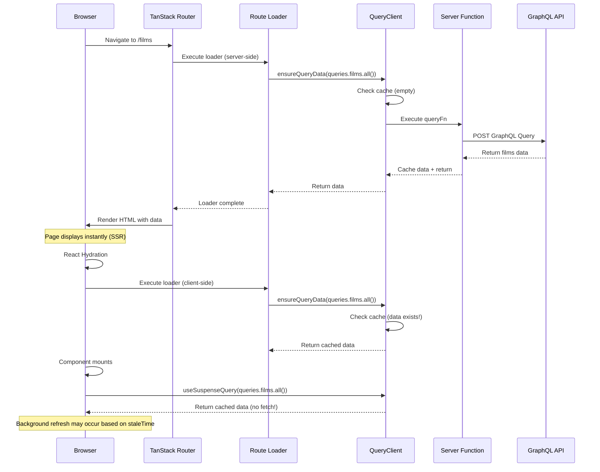
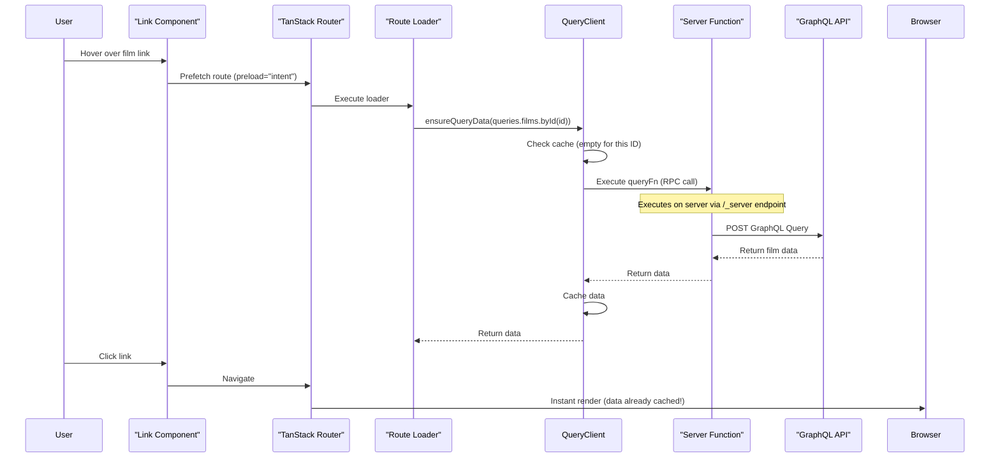
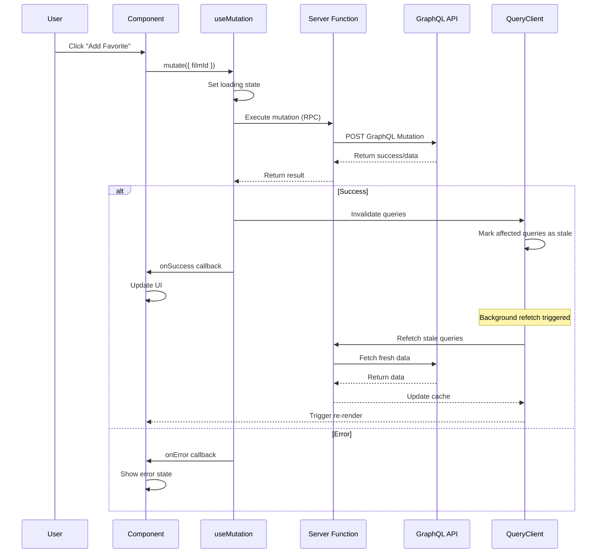
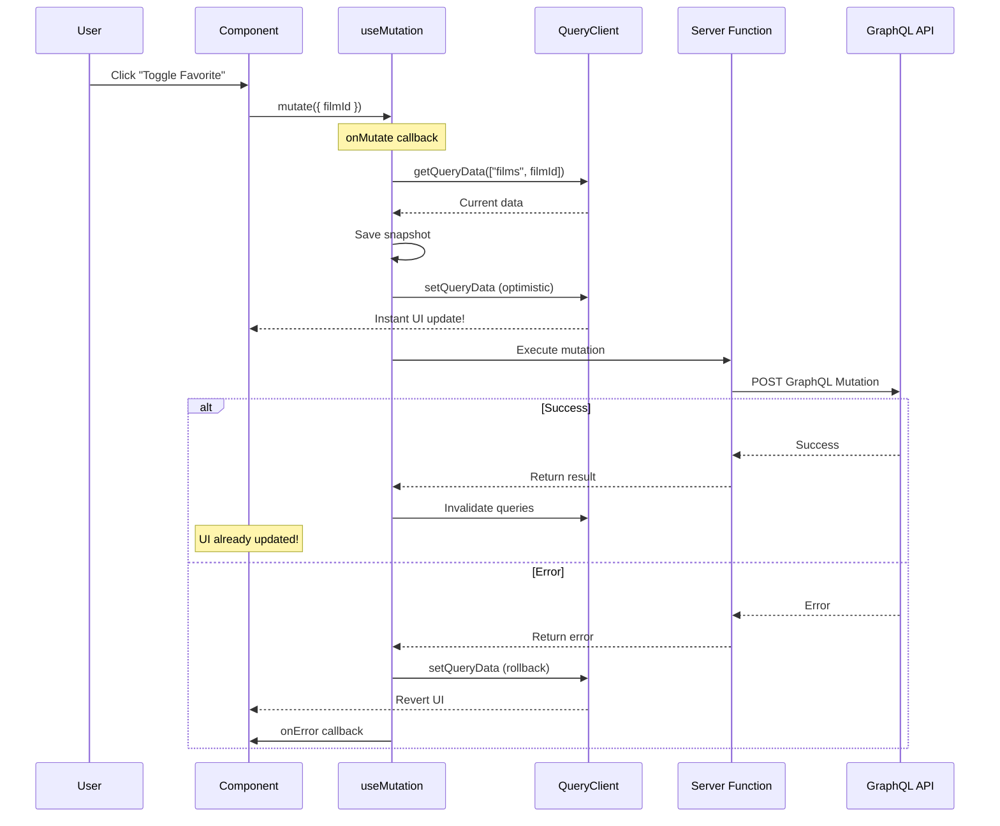

# TanStack Start + Query + GraphQL Data Flow Guide

This guide explains how data flows through the application using TanStack Start, TanStack Query, and GraphQL with Server Functions.

## Table of Contents

- [Query Flow](#query-flow)
- [Mutation Flow](#mutation-flow)
- [Examples](#examples)
- [Key Concepts](#key-concepts)

## Query Flow

### SSR Initial Load Flow



### Client-Side Navigation Flow



## Mutation Flow

### Basic Mutation Flow



### Optimistic Update Flow



## Examples

### Query Example: Fetching Films

```typescript
// src/queries/films.ts
import { queryOptions } from "@tanstack/react-query";
import { graphql } from "~/graphql/";
import { request } from "~/graphql/request";

export const all = () =>
  queryOptions({
    queryKey: ["films", "all"],
    staleTime: 60 * 1000, // Consider fresh for 60 seconds
    queryFn: async () => {
      const query = graphql(`
        query AllFilms {
          allFilms {
            films {
              id
              title
              director
              releaseDate
            }
          }
        }
      `);

      const result = await request(query);

      if (result.errors) {
        throw new Error(result.errors[0].message);
      }

      return result.data?.allFilms?.films;
    }
  });

// src/routes/index.tsx
export const Route = createFileRoute("/")({
  loader: async ({ context: { queryClient, queries } }) => {
    // Ensure data is in cache for SSR
    await queryClient.ensureQueryData(queries.films.all());
  },
  component: () => {
    const { queries } = Route.useRouteContext();
    // Subscribe to query updates
    const { data: films } = useSuspenseQuery(queries.films.all());

    return <FilmList films={films} />;
  }
});
```

### Mutation Example: Adding to Favorites

```typescript
// src/queries/films.ts
export const addToFavorites = () =>
  mutationOptions({
    mutationFn: async (filmId: string) => {
      const mutation = graphql(`
        mutation AddToFavorites($filmId: ID!) {
          addToFavorites(filmId: $filmId) {
            id
            isFavorite
          }
        }
      `);

      const result = await request(mutation, { filmId });

      if (result.errors) {
        throw new Error(result.errors[0].message);
      }

      return result.data?.addToFavorites;
    },
    onSuccess: (data, variables, context) => {
      // Invalidate and refetch any queries that could be affected
      queryClient.invalidateQueries({ queryKey: ["films"] });
      queryClient.invalidateQueries({ queryKey: ["favorites"] });
    }
  });

// src/components/FavoriteButton.tsx
function FavoriteButton({ filmId }: { filmId: string }) {
  const { queries } = Route.useRouteContext();
  const queryClient = useQueryClient();

  const mutation = useMutation({
    ...queries.films.addToFavorites(),
    // Optimistic update
    onMutate: async (filmId) => {
      // Cancel outgoing refetches
      await queryClient.cancelQueries({ queryKey: ["films", filmId] });

      // Snapshot previous value
      const previousFilm = queryClient.getQueryData(["films", filmId]);

      // Optimistically update
      queryClient.setQueryData(["films", filmId], old => ({
        ...old,
        isFavorite: true
      }));

      // Return context with snapshot
      return { previousFilm };
    },
    onError: (err, filmId, context) => {
      // Rollback on error
      if (context?.previousFilm) {
        queryClient.setQueryData(["films", filmId], context.previousFilm);
      }
    }
  });

  return (
    <button
      onClick={() => mutation.mutate(filmId)}
      disabled={mutation.isPending}
    >
      {mutation.isPending ? "Saving..." : "Add to Favorites"}
    </button>
  );
}
```

### Mutation Example: Updating Film Details

```typescript
// src/queries/films.ts
export const updateFilm = () =>
  mutationOptions({
    mutationFn: async ({ id, ...updates }: UpdateFilmInput) => {
      const mutation = graphql(`
        mutation UpdateFilm($id: ID!, $input: UpdateFilmInput!) {
          updateFilm(id: $id, input: $input) {
            id
            title
            director
            releaseDate
          }
        }
      `);

      const result = await request(mutation, { id, input: updates });

      if (result.errors) {
        throw new Error(result.errors[0].message);
      }

      return result.data?.updateFilm;
    }
  });

// src/components/EditFilmForm.tsx
function EditFilmForm({ film }: { film: Film }) {
  const router = useRouter();
  const queryClient = useQueryClient();
  const { queries } = Route.useRouteContext();

  const mutation = useMutation({
    ...queries.films.updateFilm(),
    onSuccess: (updatedFilm) => {
      // Update the specific film in cache
      queryClient.setQueryData(
        ["films", updatedFilm.id],
        updatedFilm
      );

      // Also update it in the list
      queryClient.setQueryData(["films", "all"], (old) =>
        old?.map(f => f.id === updatedFilm.id ? updatedFilm : f)
      );

      // Navigate back
      router.navigate({ to: "/films/$id", params: { id: film.id } });
    }
  });

  const handleSubmit = (formData: FormData) => {
    mutation.mutate({
      id: film.id,
      title: formData.get("title"),
      director: formData.get("director"),
      releaseDate: formData.get("releaseDate")
    });
  };

  return (
    <form onSubmit={handleSubmit}>
      {/* Form fields */}
      <button type="submit" disabled={mutation.isPending}>
        {mutation.isPending ? "Saving..." : "Save Changes"}
      </button>
      {mutation.isError && (
        <div>Error: {mutation.error.message}</div>
      )}
    </form>
  );
}
```

## Key Concepts

### 1. Server Functions

- All GraphQL requests go through TanStack Server Functions
- Execute on the server, even when called from client
- Provide automatic RPC endpoints (/\_server/...)
- Keep GraphQL endpoint secure and hidden from client

### 2. Query Lifecycle

- **SSR**: Loader fetches data server-side
- **Hydration**: Client reuses server data
- **Background Refresh**: Based on staleTime
- **Prefetching**: Via router preload prop

### 3. Cache Management

- QueryClient holds all cached data
- Queries are identified by unique keys
- `ensureQueryData`: Fetch only if not cached
- `invalidateQueries`: Mark as stale for refetch

### 4. Mutation Patterns

- **Basic**: Simple fire-and-forget
- **With Invalidation**: Refetch affected queries
- **Optimistic**: Update UI before server response
- **With Rollback**: Revert on error

### 5. Error Handling

- Queries: Error boundaries + error components
- Mutations: onError callbacks + error states
- GraphQL errors: Check result.errors array
- Network errors: Try/catch in queryFn

### 6. Performance Tips

- Set appropriate `staleTime` to reduce refetches
- Use `prefetch` on links for instant navigation
- Leverage optimistic updates for snappy UI
- Use `select` to transform/filter data
- Configure `gcTime` to control cache retention
